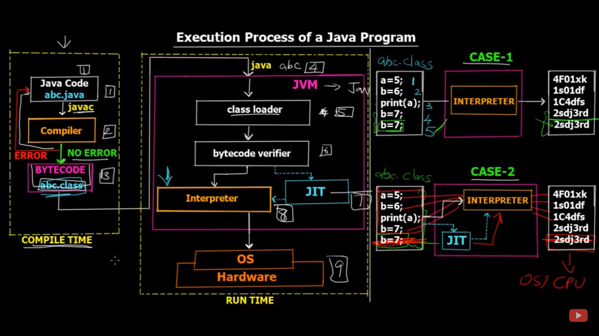
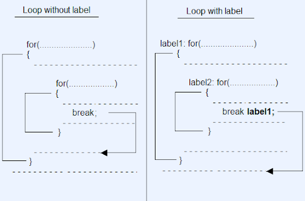

INDEX
=============
[Chapter I: Java Building Blocks](#Chapter-i--Java-Building-Blocks)

[Chapter II : Operators and Statements](#Chapter-ii--Operators-and-Statements)


# Chapter I: Java Building Blocks


### Contents

1. [Execution process of a java program](#Execution-process-of-a-java-program)

2. [JVM](#jvm)

3. [Classes vs Files](#Classes-vs-Files)

4. [Main method](#Main-method)
<!--* [Command line arguments](#Command-line-arguments)-->

5. [Package Declarations and Imports](#Package-Declarations-and-Imports)

6. [Constructors](#Constructors)

7. [Instance initializers](#Instance-initializers)

8. [Primitive Datatypes](#Primitive-Datatypes)

9. [Type promotion in Expressions](#Type-promotion-in-Expressions)

10. [Declaring multiple variables](#Declaring-multiple-variables)

11. [Identifiers](#Identifiers)

12. [Local variables](#Local-variables)

13. [Instance and Class variables](#Instance-and-Class-variables)

14. [ordering elements in a class](#ordering-elements-in-a-class)

15. [Destroying objects and GC](#Destroying-objects)


## Execution process of a java program 



1) the source code(.java file) is compiler using a compiler(javac) and byte code(.class files ) are generated.

2) when a class is excecuted (java abc) the class loader loads the .class file and bytecode is verified, the code is now going to get interpreted using a JIT complier(gives only needed lines to the interpreter to improve effieciency) and a interpreter.

3) this converts the code to machine language and is given to the OS for excecution.


**IMPORTANT POINTS**

* The byte code(.class file) is portable(platform independent).
* JVM is platform dependent (it coverts the byte code into the corresponding OS machine code).

## JVM

* The main method(startup of the Java process) is managed by the JVM. The JVM calls on the underlying system to allocate memory and CPU time, access files etc.
* JVM is platform dependent.

## Classes vs Files

* When we have two classes in the same file. Atmost one of the classes in the file is allowed to be public.
* If there are multiple classes and one of them is public then it needs to match the filename.
* If there are no public classes you can compile the code succesfully(with differnt file name also), but while running you must run the excecutable class file(one with main).
* The java sources code is stored in .java files (name same as class name).
* Byte code is stored in .class file with same name of the class.

## Main method
`public static void main(String args[])`
* the main method must be public and static.If the method is not static it becomes invisible to the JVM.
The main class is called without creading a object of the class, the JVM takes care of it.

* The parameters to the main method is a array of strings.(to take command line arguments)
It can be written in the following forms `String[] args`, `String args[]` or `String... args` and can use any name instead of "args".

#### Command line arguments

* spaces are used to separate the arguments.
* we need to use quotes to have spaces inside the arguments.

```
$ javac Zoo.java 
$ java Zoo "San Diego" Zoo 

```

* All command line argumnets are treated as String objects even if they represent other datatypes.


## Package Declarations and Imports
#### Packages
* Preventing naming conflicts. For example there can be two classes with name Employee in two packages, college.staff.cse.Employee and college.staff.ee.Employee
* Making searching/locating and usage of classes, interfaces, enumerations and annotations easier
* Providing controlled access: protected and default have package level access control. A protected member is accessible by classes in the same package and its subclasses. A default member (without any access specifier) is accessible by classes in the same package only.
* Packages can be considered as data encapsulation (or data-hiding).
**Notes**
*  Java puts classes in packages. These are logical groupings for classes. 
*  If it begins with java or javax, this means it came with the JDK
#### Wildcards
* Classes in the same package are often imported together. You can use a shortcut to import all the classes in a package:

```import java.util.*;    // imports java.util.Random among other things ```
* Every class in the java.util package is available to this program when Java compiles it. It doesn’t import child packages, fi elds, or methods; it imports only classes.
*  “static import” that imports other types.

#### Naming conflicts
Sometimes we can import a class that can be found in multiple places.
Example Date class, java provides implementations of `java.util.Date` and `java.sql.Date`
for the following object creation
```
public class Conflicts
{
Date date;
}
```
1) When the class is found in multiple packages, Java gives you the compiler error:
The type Date is ambiguous

```
import java.util.*;
import java.sql.*;//Does not compile
```
2) It takes precedence over any wildcards present
```
import java.util.Date; 
import java.sql.*;
```
3) error: a type with the same simple name is already defined by the single-type-import of Date
import java.sql.Date;
```
import java.util.Date; 
import java.sql.Date;

```
**Solution**
```
public class Conflicts { java.util.Date date; java.sql.Date sqlDate;
}

```
#### Creating a new package


## Constructors
* Constructor is a special type of method that creates a new object.
* the name of the constructor matches the name of the class, and there’s no return type
* if a constuctor is not defined the compiler provides a default constructor(This Java-created constructor is called the default constructor. Sometimes we call it the default no-arguments constructor ), but once a user defined constructor is provided the compiler doesnt provide the  default constructor anymore.
* constructors can be overloaded.
* The constructor is part of the initialization process, so it is allowed to assign final instance variables in it. By the time the constructor completes, all final instance variables must have been set.

#### Constructor chaining
```
Overloaded constructors often call each other. One common technique is to have each constructor add one parameter until getting to the constructor that does all the work. This approach is called constructor chaining. In this example, all three constructors are chained.
public class Mouse {   private int numTeeth;   private int numWhiskers;   private int weight;
   public Mouse(int weight) {     this(weight, 16); // calls constructor with 2 parameters   }   public Mouse(int weight, int numTeeth) {    this(weight, numTeeth, 6); // calls constructor with 3 parameters   }   public Mouse(int weight, int numTeeth, int numWhiskers) {     this.weight = weight;     this.numTeeth = numTeeth;     this.numWhiskers = numWhiskers;   }   public void print() {     System.out.println(weight + " " + numTeeth + " " + numWhiskers);   }   public static void main(String[] args) {     Mouse mouse = new Mouse(15);     mouse.print();   } }
This code prints 15 16 6. The main() method calls the constructor with one parameter. That constructor adds a second hard-coded value and calls the constructor with two parameters. That constructor adds one more hard-coded value and calls the constructor with three parameters. The three-parameter constructor assigns the instance variables.
```

#### constructors during inheritance
* during the creation on a derived class object :
    1) Base Class Constructor Called
    2) Derived Class Constructor Called
* If we want to call a parameterized constructor of the base class we must use `super` otherwise it will throw an error.
Because by default the default constructor of base class is called from the derived class constructor.
## Instance initializers
* the code blocks( {} ) appearing inside the class outside the methods are called instance initializers.
## Static initializers

#### Order of execution of Initialization blocks and constructor in Java

* Static initialization blocks will run whenever the class is loaded first time in JVM
* Initialization blocks run in the same order in which they appear in the program.
* Instance Initialization blocks are executed whenever the class is initialized and before constructors are invoked. They are typically placed above the constructors within braces.

**During inheritance**

```
// Java code to illustrate order of 
// execution of constructors, static 
// and initialization blocks 
class A{
  {
    System.out.println("Base 1st instance init"); 
  }
  static
  {
    System.out.println("Base 1st static init"); 
  }
  
  A()
  {
    System.out.println("Base class No argument constructor");
  }
  {
    System.out.println("Base 2nd instance init"); 
  }
}
class B extends A
{
{
    System.out.println("Derived 1st instance init"); 
  }
  static
  {
    System.out.println("Derived 1st static init"); 
  }
  B()
  {
    System.out.println("Derived class No argument constructor");
  }
  B(int x)
  {
    System.out.println("Derived class ONE argument constructor");
  }
  {
    System.out.println("Derived 2nd instance init"); 
  }
}
class GFG { 


	public static void main(String[] args) 
	{ 
		
		new B(8); 
        {
    System.out.println("============DONE========"); 
  }
        new B();
        {
    System.out.println("============DONE========"); 
  }
	} 
} 
```
output
```
Base 1st static init
Derived 1st static init
Base 1st instance init
Base 2nd instance init
Base class No argument constructor
Derived 1st instance init
Derived 2nd instance init
Derived class ONE argument constructor
============DONE========
Base 1st instance init
Base 2nd instance init
Base class No argument constructor
Derived 1st instance init
Derived 2nd instance init
Derived class No argument constructor
============DONE========
```
## Primitive Datatypes
UNI code in java - it takes 2 bytes for a character(to represent different scripts)

datatype|space(bytes)|
---------|-----|
boolean|1bit|
byte| 8-bit|
short|16-bit|
int|32-bit|
float|32-bit|
long|64-bit|
double|64-bit|
char|16-bit unicode|

* **octal** (digits 0–7), which uses the number **0** as a prefix—for example, 017 
* **hexadecimal** (digits 0–9 and letters A–F), which uses the number 0 followed by **x or X** as a prefix—for example, 0xFF 
* **binary** (digits 0–1), which uses the number **0 followed by b or B** as a prefix—for example, 0b10

double and float store exponents

#### Numeric literals
You can have underscores in numbers to make them easier to read:
```
int million1 = 1000000; 
int million2 = 1_000_000;
```
We’d rather be reading the latter one because the zeroes don’t run together. You can add underscores anywhere except at the beginning of a literal, the end of a literal, right before a decimal point, or right after a decimal point. Let’s look at a few examples:
```
double notAtStart = _1000.00;        // DOES NOT COMPILE double notAtEnd = 1000.00_;          // DOES NOT COMPILE double notByDecimal = 1000_.00;      // DOES NOT COMPILE double annoyingButLegal = 1_00_0.0_0;  // this one compiles
```
## Type promotion in Expressions

While evaluating expressions, the intermediate value may exceed the range of operands and hence the expression value will be promoted. Some conditions for type promotion are:

* Java automatically promotes each byte, short, or char operand to int when evaluating an expression.
* If one operand is a long, float or double the whole expression is promoted to long, float or double respectively.
* all compoud operators perform implicit type casting

```
class Test2
{
    public static void main(String [] args)
    {
        byte b=25;
        b+=10;//implicit conversion.(b=(byte)(b+10))
        System.out.println("Byte value: "+b);
    }
}
```

* narrowing error

```
class Test2
{
    public static void main(String [] args)
    {
        byte b=25;
        b=b+10;//narroeing error
        /* whenever an operation is performed on a byte,short,char it is automatically converted/upgraded to int
        right hand side int left hand side byte*/
        System.out.println("Byte value: "+b);
    }
}
```
## Declaring multiple variables

```
boolean b1, b2;//legal
String s1 = "1", s2;//legal
double d1, double d2;//not legal
int i1; int i2;//legal
int i3; i4;//legal
```
## Identifiers

There are only three rules to remember for legal identifi ers: 
* The name must begin with a letter or the symbol $ or _.  *  Subsequent characters may also be numbers.  
* You cannot use the same name as a Java reserved word. As you might imagine, a reserved word is a keyword that Java has reserved so that you are not allowed to use it. Remember that Java is case sensitive, so you can use versions of the keywords that only differ in case. Please don’t, though.


## Local variables
**Local variables must be initialised before use**

The compiler is smart enough to recognize variables that have been initialized after their declaration but before they are used.
```
public int valid() { 
int y = 10;
int x; // x is declared here  
x = 3; // and initialized here  
int reply = x + y;  
return reply; }

```
The compiler is also smart enough to recognize initializations that are more complex. 
```
public void findAnswer(boolean check) {  
int answer;  
int onlyOneBranch;  
if (check) {    
    OnlyOneBranch = 1;    
    answer = 1;  
} 
else 
{    
    answer = 2;  
}  
System. out .println(answer);
System. out .println(onlyOneBranch); // DOES NOT COMPILE }
```

## Instance and Class variables
instance variables or class variables are also called fields
Instance and class variables do not require you to initialize them. As soon as you declare these variables, they are given a default value

## ordering elements in a class

Element| Example |Required? |Where does it go?|
-------|---------|----------|-------|

Package declaration| package abc;| No |First line in the file|

Import statements| import java.util.*;| No| Immediately after the package|
Class declaration| public class C |Yes |Immediately after the import|

Field declarations| int value;| No |Anywhere inside a class|
Method declarations| void method()| No |Anywhere inside a class|

## Destroying objects
 
All Java objects are stored in your program memory’s heap. The heap(free store) represents a large pool of unused memory allocated to your Java application. The heap may be quite large, depending on your environment, but there is always a limit to its size. If your program keeps instantiating objects and leaving them on the heap, eventually it will run out of memory. 
Java provides a garbage collector to automatically look for objects that aren’t needed anymore and free up space.

#### Garbage collection
Garbage collection refers to the process of automatically freeing memory on the heap by deleting objects that are no longer reachable in your program
` System.gc() ` is a method which gives request to the GC to run.(no guarantee it will run)
```
 public class Scope { 
 public static void main(String[] args) { 
 String one, two; 
 one = new String("a"); 
 two = new String("b"); 
 one = two; //here "a" becomes orphan and eligible for GC
 String three = one; 
 one = null;  
 } }// here "b" goes out of scope and eligible for GC

```
#### Finilize()
Java allows objects to implement a method called finalize() that might get called. This method gets called if the garbage collector tries to collect the object. If the garbage collector doesn’t run, the method doesn’t get called
 If the garbage collector fails to collect the object and tries to run it again later, the method doesn’t get called a second time. 

# Chapter II : Operators and Statements

### Contents
1. [Java Operators](#Java-Operators)
2. [Numeric promotion](#Numeric-promotion)
3. [Unary operators](#Unary-operators)
4. [Increment and Decrement operators](#Increment-and-Decrement-operators)
5. [Assignment Operators and casting](#Assignment-Operators)
6. [Relational Operators and instanceof operator](#Relational-Operators)
7. [Logical operators](#Logical-operators)
8. [Equality Operators](#Equality-Operators)
9. [Java Statements](#Java-Statements)
    * [If-then statements](#If-then-statements)
    * [Ternary Operator](#Ternary-Operator)
    * [Switch statement](#Switch-statement)
    * [For loop](#For-loop)
    * [Nested loops and Control stuctures](#Nested-loops-and-Control-stuctures)
## Java Operators
Types of operators:
1. unary
2. binary
3. ternary
#### Operator presedence
**NOTE**
The modulus operation is not limited to positive integer values in Java and may also be applied to negative integers and floating-point integers. For a given divisor y and negative dividend, the resulting modulus value is between and (-y + 1. and 0
## Numeric promotion
**Rules**
1. If two values have different data types, Java will automatically promote one of the values to the larger of the two data types. 
2. If one of the values is integral and the other is floating-point, Java will automatically promote the integral value to the floating-point value’s data type.
3. Smaller data types, namely byte, short, and char, are first promoted to int any time they’re used with a Java binary arithmetic operator, even if neither of the operands is int. 
4. After all promotion has occurred and the operands have the same data type, the resulting value will have the same data type as its promoted operands.
**Note**
Using unary operators/compound assignment operators (++,+=) follows impicit conversion so they arent converted to int.
## Unary operators
+, -, ++, --, !
! can be used only to boolean expression
- can be used only to numeric expression
**Note**
in Java 1 and true are not related in any way, just as 0 and false are not related.
## Increment and Decrement operators
* can be applied to only variables (not constants)
`10++//compiletime error`
* nesting of both ++ and -- operators not allowed
`int b=++(++a);//error`

Example:
```
int x = 3; 
int y = ++x * 5 / x-- + --x; 
```
Step I :`int y = 4 * 5 / x-- + --x;  // x assigned value of 4`
Step II : `int y = 4 * 5 / 4 + --x;  // x assigned value of 3`
Step III : `int y = 4 * 5 / 4 + 2;  // x assigned value of 2`
Answer:
`x=2 and y=7`
## Assignment Operators

```
int x = 1.0;  // DOES NOT COMPILE double assigned to int
short y = 1921222;  // DOES NOT COMPILE out of range for short
int z = 9f;  // DOES NOT COMPILE treats as float
long t = 192301398193810323;  // DOES NOT COMPILE interprests as int (use 'L')
```
**Note**
```
long x = 5; 
long y = (x=3); 
System.out.println(x); // Outputs 3 
System.out.println(y); // Also, outputs 3
```
The key here is that (x=3) does two things. First, it sets the value of the variable x to be 3. Second, it returns a value of the assignment, which is also 3. The exam creators are fond of inserting the assignment operator = in the middle of an expression and using the value of the assignment as part of a more complex expression.

#### Casting Primitive values
Used for narrowing (big datatype to small)
Overfl ow is when a number is so large that it will no longer fi t within the data type, so the system “wraps around” to the next lowest value and counts up from there. There’s also an analogous underfl ow, when the number is too low to fi t in the data type.

`System.out.print(2147483647+1);  // -2147483648`

**Wrapping around**

* byte short int long - wrapping around.(byte can hold -128 to 127)

```
class Test2
{
    public static void main(String [] args)
    {
        byte b=(byte)129;
        System.out.println("Byte value: "+b);
    }
}
 
```
* int to byte and double to byte 

 
```
//Java program to illustrate Conversion of int and double to byte 
class Test 
{ 
	public static void main(String args[]) 
	{ 
		byte b; 
		int i = 257; 
		double d = 323.142; 
		System.out.println("Conversion of int to byte."); 
		
		//i%256 
		b = (byte) i; 
		System.out.println("i = " + i + " b = " + b); 
		System.out.println("\nConversion of double to byte."); 
		
		//d%256 
		b = (byte) d; 
		System.out.println("d = " + d + " b= " + b); 
	} 
} 

```

## Relational Operators

**Note**

```
int x=0;
int y=0;
System.out.println(x>y);//Outputs false
```
Not strictly greater than
#### Instanceof Operator
a instanceof(b) | True if the reference that `a` points to is an instance of a class, subclass, or class that implements a particular interface, as named in `b`.
POints to remeber:
```
class Parent{}
class Child extends Parent{}
```

1) Parent object not instance of Child

`Parent pobj = new Parent();`
`System.out.println(pobj instanceof Child); //False`
`System.out.println(pobj instanceof Parent); //True`
2) Parent referencing Child is an instance of Child

`Parent cobj = new Child();`
`System.out.println(cobj instanceof Child); //True`
`System.out.println(cobj instanceof Parent); //True`

## Logical operators

'&' , '|' , '^' - applied to both numeric(bitwose) and boolean(logical) datatypes.
'&&' , '||' - **short circuit operators** only boolean type
evaluated left-right
**Demonstration of Short circuit**
```
int x = 6; boolean y = (x >= 6) || (++x <= 7); System.out.println(x);

```
Because x >= 6 is true, the increment operator on the right-hand side of the expression is never evaluated, so the output is 6.
## Equality Operators
1. Comparing two numeric primitive types. If the numeric values are of different data types, the values are automatically promoted as previously described. For example, 5 == 5.00 returns true since the left side is promoted to a double. 
2. Comparing two boolean values. 
3. Comparing two objects, including null and String values.
**Note**
We cant mix up the three cases they will return compile errors
```
boolean x = true == 3;  // DOES NOT COMPILE 
boolean y = false != "Giraffe";  // DOES NOT COMPILE 
boolean z = 3 == "Kangaroo";  // DOES NOT COMPILE
```
```
File x = new File("myFile.txt"); 
File y = new File("myFile.txt");
File z = x; System.out.println(x == y);  // Outputs false 
System.out.println(x == z);  // Outputs true

```
## Java Statements
#### If-then statements

```
int x = 1; 
if(x) {  // DOES NOT COMPILE  ... }
```
#### Ternary Operator
There is no requirement that second and third expressions in ternary operations have the same data types, although it may come into play when combined with the assignment operator. Compare the following two statements:
```
System.out.println((y > 5) ? 21 : "Zebra"); 
int animal = (y < 91) ? 9 : "Horse";  // DOES NOT COMPILE
```
#### Switch statement
Supported datatypes:
* int and Integer 
* byte and Byte 
* short and Short 
* char and Character 
* String 
* enum values

**Note**

* Duplicate case values are not allowed.
* The value for a case must be of the same data type as the variable in the switch.
* The value for a case must be a constant or a literal. Variables are not allowed.
* The break statement is used inside the switch to terminate a statement sequence.
* The break statement is optional. If omitted, execution will continue on into the next case.
* The default statement is optional and can appear anywhere inside the switch block. In case, if it is not at the end, then a break statement must be kept after the default statement to omit the execution of the next case statement.
Exmaple:
```
private int getSortOrder(String firstName, final String lastName) {
String middleName = "Patricia";  
final String suffix = "JR";  
int id = 0; 
switch(firstName) {    
    case "Test":      
        return 52;
    case middleName:  // DOES NOT COMPILE  (middle name not final variable ie.,constant)    
        id = 5;      
        break;    
    case suffix:      
        id = 0;      
        break;    
    case lastName:  // DOES NOT COMPILE  (lastname is not constant as it is passed to the function)    
        id = 8;      
        break;    
    case 5:  // DOES NOT COMPILE (not matching datatype)      
        id = 7;      
        break;    
    case 'J':  // DOES NOT COMPILE      (not matching datatype)      
        id = 10;      
        break;    
    case java.time.DayOfWeek.SUNDAY:  // DOES NOT COMPILE    (not matching datatype)        
        id=15;      
        break;  
        }  
    return id; 
}
```
#### For loop
1)
``` 
for( ; ; ){}//infite loop
```
``` 
for(  ) or for( ; ) //compile error
{}
```
2) Multiple terms
```
int x = 0; 
for(long y = 0, z = 4; x < 5 && y < 10; x++, y++) {  
System.out.print(y + " "); 
} 
System.out.print(x);
```
3) Redeclaring a Variable in the Initialization Block 
```
int x = 0; 
for(long y = 0, x = 4; x < 5 && y < 10; x++, y++) {   // DOES NOT COMPILE  System.out.print(x + " "); }
```
4) Using Incompatible Data Types in the Initialization Block 
```
for(long y = 0, int x = 4; x < 5 && y<10; x++, y++) {   // DOES NOT COMPILE  System.out.print(x + " "); } 
```
5) Using Loop Variables Outside the Loop 
```
for(long y = 0, x = 4; x < 5 && y < 10; x++, y++) {  System.out.print(y + " "); } System.out.print(x);  // DOES NOT COMPILE
```
#### for-each Statement
#### Nested loops and Control stuctures

**Break statement**

Usage of break statement in a nested loop terminates the inner loop in which break statement is written.


**Labled Break statement**



**Labled Continue statement**

```
public class SwitchSample {  
public static void main(String[] args) {    
FIRST_CHAR_LOOP: for (int a = 1; a <= 4; a++) {      
    for (char x = 'a'; x <= 'c'; x++) {        
        if (a == 2 || x == 'b')          
            continue FIRST_CHAR_LOOP;        
        System.out.print(" " + a + x);      
    }    
    }  
} 
}
```
# Chapter II : Java API

### Contents
1. [Java Operators](#Java-Operators)
# Strings
* strings dont have to be intantiated with new.
## String concatenation
**Rules**
1. if **either** operands is string '+' means concatenation
2. if both operands is numeric '+' means addition
3. expresion is evaluated left to right
example:
```
int three = 3; 
String four = "4"; 
System.out.println(1 + 2 + three + four);
```
result is '64'
```
String s="1";
s+="2";
s+=3;
System.out.println(s);//123
```
## Immutability
* Once a string object is created its not allowed to be changed.
* You can only change the reference of the string.(to avoid doing so me can reclare the string reference as final)

## String Pool
* String pool is located inside JVM. Used for efficient memory management.
* String pool contains the literal values that appear in our program.
```
System.out.println("Hello World!");
String f = "Hello";
f+"KMIT";//created on string constant pool
```
**Does garbage colecter reclaim memory from string constant pools?**

```
String name = "Fluffy";//uses string pool
String name = new String("Fluffy");//not so efficient//created on heap
```
## String methods
#### length()
#### charAt()
* throws stringIndexOutOfBoundsException
#### indexOf()
`int indexOf(char ch)` 
`int indexOf(char ch, index fromIndex)` 
`int indexOf(String str)` 
`int indexOf(String str, index fromIndex)`
return -1 if not found.
#### substring()
`int substring(int beginIndex)//default till end of string` 
`int substring(int beginIndex, int endIndex)//end index not included`

Example
```
String string = "animals"; 
System.out.println(string.substring(3));  // mals System.out.println(string.substring(string.indexOf('m'))); // mals System.out.println(string.substring(3, 4)); // m
```
```
System.out.println(string.substring(3, 2));  // throws exception(runtime)
System.out.println(string.substring(3, 8)); // throws exception(runtime)
```
#### toLowerCase() and toUpperCase()
`String toUpperCase()`
`String toLowerCase()`
* immutable so original string remains same.
* numericals and special chars are not changed.

Example:
```
String string = "animals"; 
System.out.println(string.toUpperCase());  // ANIMALS
System.out.println("Abc123".toLowerCase());  // abc123
```
#### equals() and equalsIgnoreCase()
`boolean equals()`
`boolean equalsIgnoreCase()`
Example:
```
System.out.println("abc".equals("ABC"));  // false System.out.println("ABC".equals("ABC"));  // true System.out.println("abc".equalsIgnoreCase("ABC"));  // true
```
#### startsWith() and endsWith()
`boolean startsWith()`
`boolean endsWith()`
Example:
```
System.out.println("abc".startsWith("a")); // true System.out.println("abc".startsWith("A")); // false System.out.println("abc".endsWith("c")); // true System.out.println("abc".endsWith("a")); // false
```
#### contains
`boolean contains()`
Example
```
System.out.println("abc".contains("b")); // true System.out.println("abc".contains("B")); // false
```
#### replace()
`String replace(char oldChar, char newChar)` 
`String replace(CharSequence oldChar, CharSequence newChar)`
Example:
```
System.out.println("abcabc".replace('a', 'A')); // AbcAbc System.out.println("abcabc".replace("a", "A")); // AbcAbc
```
#### trim()
`public String trim()`
Example:
```
System.out.println("abc".trim());           // abc 
System.out.println("\t   a b c\n".trim()); // a b c
```
## Method chaining
```
String result = "AniMaL   ".trim().toLowerCase().replace('a', 'A'); System.out.println(result);
```
## StringBuilder

The StringBuilder class creates a String without storing all those interim String values. Unlike the String class, StringBuilder is **not immutable**.
```
		StringBuilder s = new StringBuilder();
		StringBuilder p = new StringBuilder("kmit");
		s=p;
		s.append("ngit");
		s=s.append("hi");
		System.out.println(s+" "+p);//s="kmitngithi" p="kmitngithi"
```
**Note**
Stringbuilder is mutable when we say `s=p` s and p point to same string ref.
So if we modify value at s since p also stores same value it is reflected.
```
		StringBuilder sb1 = new StringBuilder("kmit");
		StringBuilder sb2 = new StringBuilder(sb1);
		StringBuilder sb3=sb1;
        System.out.println(sb1+" "+sb2+" "+sb3);// kmit kmit kmit
		sb3 = new StringBuilder("ngit");
		System.out.println(sb1+" "+sb2+" "+sb3);// kmit kmit ngit

```
**Note**
Here sb3 is made to point to another location by the usage of new StringBuilder, which doesnt effect sb1;
Only while performing operations such as append these changes are refected to sb1.

#### Creating StringBuilder
```
StringBuilder sb1 = new StringBuilder();
StringBuilder sb2 = new StringBuilder("animal"); 
StringBuilder sb3 = new StringBuilder(10);//give capacity which can be modified automaticlly
```
We can replace StringBuilder with StringBuffer to get same results as above.
#### chatAt(), indexOf(), length(), substring()
work same as in String class.
#### append()
```
StringBuilder sb = new StringBuilder().append(1).append('c'); 
sb.append("-").append(true); 
System.out.println(sb);      // 1c-true
```
#### insert()
The insert() method adds characters to the StringBuilder at the requested index and returns a reference to the current StringBuilder.
```
StringBuilder sb = new StringBuilder("animals");     		
    sb.insert(7, "-");                   	
	sb.insert(0, "-");                   
	sb.insert(4, "-");                   	
    System.out.println(sb);//-ani-mals-

```
#### delete() and deleteCharAt()
```
StringBuilder delete(int start, int end) //excluding end
StringBuilder deleteCharAt(int index)
```
Example:
```
StringBuilder sb = new StringBuilder("abcdef"); 
sb.delete(1, 3);                  // sb = adef 
sb.deleteCharAt(5);                   // throws an exception
```
#### reverse()
```
StringBuilder sb = new StringBuilder("ABC"); 
sb.reverse(); 
System.out.println(sb);
```
#### toString()
converst StringBuilder to String
`String s = sb.toString();`
pg164

## StringBuffer
StringBuffer is threadsafe while stringbuilder isnt
It was used before stringbuilder was added in Java5


## Equality and Comparing Strings
'==' -> checks for the references of the objects not the values.
```
StringBuilder one = new StringBuilder(); 
StringBuilder two = new StringBuilder(); 
StringBuilder three = one.append("a"); 
System.out.println(one == two); // false 
System.out.println(one == three); // true

```
We know that stringbuilders ane mutable.
```
    String q="Hello World";
    String r="Hello World";
    String s=" Hello World";//line-3
    s=s.trim();//line-4
    System.out.println(s);// "Hello World"
    System.out.println(s==q);//false line-6
    System.out.println(r==q);//true
```
at line 6 we assume that the answer should be `true` but it is not.
at line-4 the trim() function return a new string ref (new string) at runtime.
But, **strings are poled at compile time** therefore it return false.
has it been `String s="Hello World";` at line-3 then the answer at line-6 is true, because the source code of trim return `this` the same ref.
## equals()
The String equals() method overrides the equals() method of Object class.
```
String x = "Hello World"; String z = " Hello World".trim(); System.out.println(x.equals(z)); // true
```
```
String a = new String("kmit");
		String b = new String("kmit");
		System.out.println(a.equals(b));

```
**NOTE**

```     StringBuilder a = new StringBuilder("kmit");
		StringBuilder b = new StringBuilder("kmit");
		System.out.println(a.equals(b));//false
```
StringBuilder doesnt implement `equals()` method therefore in such cases it will check the references.

<!--
### Contents
## JAVA operators
#### operator precedence
## JAVA core APIs
String name = "Fluffy";//string/literal pool
String name = new String("Fluffy");//crewated on heap
replacd vs replace all
string builder
##
## Arrays


-->


<!--during overloading
widening
autoboxing
varargs
varagrs invoked with 0 arguments also
varargs should be last argument and the only one varg args is allowed
converting arraylost to array should stored in object arrya
ex: Object[] arr = list.toArray(); //only to object array
generics need to maintain backward compatibiluty
covertinf array to list
List<> list=Arrays.asList(array);-------->


marker interface - Serializable
functional interface - only one abstract method


